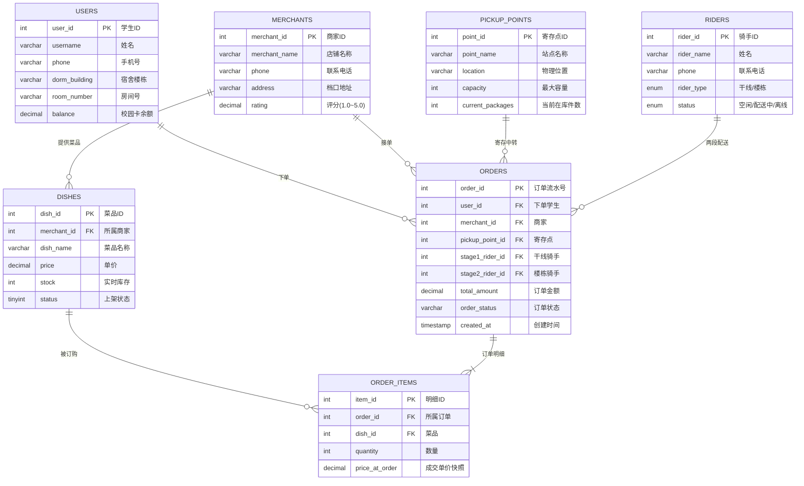

<p align="center">
  
  
  
  
  
  
</p>

<h1 align="center">校园外卖两段式配送数据库系统</h1>

<p align="center">
  <strong>Campus Delivery Two-Stage Distribution Database System</strong><br>
  期末答辩项目 · Flask + ECharts + MySQL + DeepSeek AI 实时监控大屏
</p>

<p align="center">
  
  
  
</p>

---

## 项目背景

传统外卖平台在校园场景下面临**"最后500米"**配送难题：校外骑手无法进入宿舍区，学生需下楼自取，体验差、效率低。本项目设计了一套完整的两段式配送数据库系统，将配送链路拆分为**干线运输（商家→寄存点）**和**楼栋配送（寄存点→宿舍）**两个独立阶段，通过数据库行级锁、触发器、存储过程等技术保障高并发下的数据一致性与库存安全。

系统同时集成 **Flask + ECharts 实时监控大屏**和 **DeepSeek Text-to-SQL 智能查询助手**，为运营团队提供从数据采集、实时监控到智能分析的全链路解决方案。

---

## 核心亮点

<table>
<tr>
<td width="50%">

### 两段式配送模型
将传统外卖配送拆分为两个独立阶段，由**干线骑手**和**楼栋骑手**分工协作：

```
商家出餐 → 干线骑手取餐 → 寄存点入柜
    ↓
楼栋骑手取件 → 配送至宿舍 → 学生收货
```

- 干线骑手专注商家→寄存点，单次可携带多单
- 楼栋骑手专注寄存点→宿舍，熟悉楼栋分布
- 寄存点作为缓冲，解耦两段配送节奏

</td>
<td width="50%">

### 高并发防超卖机制
双重保障确保库存扣减安全：

| 防护层 | 机制 | 说明 |
|--------|------|------|
| 行级锁 | `SELECT ... FOR UPDATE` | 事务内锁定库存行，防止并发超卖 |
| 触发器 | `trg_check_dish_stock` | 插入订单明细前自动校验库存 |
| 自动扣减 | `trg_reduce_dish_stock` | 下单成功后实时扣减库存 |
| 事务回滚 | 存储过程包裹 | 任一步骤失败即全部回滚 |

</td>
</tr>
<tr>
<td width="50%">

### 全生命周期状态机
6 种精细化订单状态，覆盖从下单到完成的完整链路：

```
Paid → Stage1_Assigned → Arrived_At_Point → Stage2_Assigned → Completed
  ↓           ↓                  ↓
  └───────────┴────── Cancelled ─┘
```

| 状态 | 含义 |
|------|------|
| `Paid` | 已支付，等待分配干线骑手 |
| `Stage1_Assigned` | 干线骑手取餐配送中 |
| `Arrived_At_Point` | 已到达寄存点，待楼栋取件 |
| `Stage2_Assigned` | 楼栋骑手配送中 |
| `Completed` | 已送达，订单完成 |
| `Cancelled` | 订单取消（任意前序阶段） |

</td>
<td width="50%">

### 实时 + 历史双模式大屏
以今天 0 点为界，自动切换数据逻辑：

| 模式 | 触发 | 数据行为 |
|------|------|----------|
| **实时模式** | 选择"今天" | 展示实时配送状态，30秒自动刷新，红色脉冲灯亮 |
| **历史模式** | 选择"近7天/30天/全部" | 历史订单全部标记 Completed（外卖时效性），用于趋势分析 |

- 5 个 KPI 指标卡实时更新
- 12 个寄存点饱和度动态监控 + 爆仓自动预警
- 商户销售排行、时段高峰分析联动时间范围

</td>
</tr>
</table>

---

## 实体关系图（E-R 图）



<p align="center">
  
  <br>
  <em>图：校园外卖两段式配送系统 E-R 实体关系图</em>
</p>

---

## 核心表结构

| 表名 | 记录数 | 说明 | 关键设计 |
|------|--------|------|----------|
| `users` | 100 | 学生用户 | `balance` 校园卡余额，`dorm_building` 关联寄存点 |
| `merchants` | 20 | 校内商家 | `rating` 评分约束 1.0~5.0，`address` 档口位置 |
| `dishes` | 160 | 商家菜品 | `stock` 实时库存（触发器自动扣减），`status` 上下架控制 |
| `pickup_points` | 12 | 宿舍寄存点 | `capacity` 容量上限，`current_packages` 实时在库数，CHECK 约束防超容 |
| `riders` | 15 | 两段骑手 | `rider_type` ENUM 区分干线/楼栋，`status` 实时工作状态 |
| `orders` | 5,000 | 订单主表 | `order_status` 6 状态流转，双骑手 ID 追踪，外键级联 |
| `order_items` | ~10,000 | 订单明细 | `price_at_order` 下单瞬间价格快照（防商家改价） |

### 数据库对象总览

| 类型 | 数量 | 名称 |
|------|------|------|
| 数据表 | 7 | `users`, `merchants`, `dishes`, `pickup_points`, `riders`, `orders`, `order_items` |
| 视图 | 2 | `vw_pickup_point_analytics`（寄存点饱和度分析）, `vw_merchant_sales_rank`（商户销售排行） |
| 存储过程 | 4 | `sp_create_order`（创建订单）, `sp_arrive_at_pickup_point`, `sp_stage2_deliver`, `sp_cancel_order` |
| 触发器 | 2 | 下单前库存校验 + 下单后库存扣减 |

---

## 实时监控大屏

### 功能一览

| 模块 | 说明 | 技术 |
|------|------|------|
| **时间范围切换** | 今天 / 近7天 / 近30天 / 本月 / 全部，所有图表联动 | JS fetch + 动态 SQL |
| **KPI 指标卡** | 今日订单量、营业额、在途骑手、活跃商家、爆仓预警 | 5 卡片玻璃态布局 + 爆仓红色呼吸灯 |
| **订单状态分布** | 今日订单实时状态环形图，中心显示总数 | ECharts 环形饼图 + 6 色状态映射 |
| **近期订单流水** | 最新 15 条订单，彩色状态标签，自动滚动 | 原生 HTML 表格 + CSS 状态标签 |
| **寄存点饱和度** | 12 个寄存点横向柱状图，绿/黄/红三级预警 | ECharts 条件着色 + markLine 爆仓线 |
| **商户销售排行** | Top 10 商户销售额横向柱状图，蓝色渐变 | ECharts 横向柱状图 |
| **时段订单分布** | 各时段订单量柱状图 + 客单价折线叠加 | ECharts 双轴混合图 |
| **数据明细查询** | 6 个 Tab 切换：商户/学生/菜品/骑手/寄存点详情 | 页内表格按需加载 |
| **AI 智能查询** | 中文问题 → DeepSeek Text-to-SQL → 结果表格 | OpenAI SDK + 安全拦截 |

### 实时 vs 历史双模式

| 点击 | 指示灯 | 刷新策略 | 数据逻辑 |
|------|--------|----------|----------|
| **今天** | 红色脉冲灯亮 | 30 秒自动刷新 | 订单保留实时状态（Paid → Completed） |
| **近7天 / 30天 / 全部** | 脉冲灯熄灭 | 手动切换刷新 | 历史订单全部显示 Completed |

---

## 项目结构

```
campus_delivery_project/
├── app.py                       # Flask 后端 + 内嵌 HTML 监控大屏（主入口）
├── dashboard_app.py             # 启动器（等价于 python app.py）
├── db.py                        # MySQL 连接池模块（PyMySQL + DBUtils）
├── campus_delivery_db.sql       # 完整数据库建库脚本（DDL + 存储过程 + 触发器 + 视图 + 种子数据）
├── reinit_db.py                 # Python 版数据库重建脚本
├── generate_mock_data.py        # 模拟数据生成器（100学生/20商家/5000订单）
├── requirements.txt             # Python 依赖列表
├── .env                         # 环境变量配置（不提交 Git）
├── images/
│   └── er_diagram.png           # E-R 实体关系图
└── README.md                    # 项目说明文档
```

---

## 快速开始

### 环境要求

- **Python** 3.8+
- **MySQL** 8.0+（需支持窗口函数与 SIGNAL 语法）
- **DeepSeek API Key**（可选，用于 AI 智能查询，[免费申请](https://platform.deepseek.com/)）

### 1. 克隆项目

```bash
git clone https://github.com/sou1maker/database.git
cd campus_delivery_project
```

### 2. 创建虚拟环境

**Windows:**
```bash
python -m venv venv
venv\Scripts\activate
```

**macOS / Linux:**
```bash
python3 -m venv venv
source venv/bin/activate
```

### 3. 安装依赖

```bash
pip install -r requirements.txt
```

### 4. 配置环境变量

编辑 `.env` 文件：

```ini
MYSQL_HOST=localhost
MYSQL_USER=root
MYSQL_PASSWORD=your_password
MYSQL_DATABASE=campus_delivery_db
MYSQL_CHARSET=utf8mb4

# 可选：DeepSeek AI 智能查询
DEEPSEEK_API_KEY=your_api_key
DEEPSEEK_BASE_URL=https://api.deepseek.com
DEEPSEEK_MODEL=deepseek-chat
```

### 5. 初始化数据库

**方式一：SQL 脚本（推荐）**
```bash
mysql -u root -p < campus_delivery_db.sql
```

**方式二：Python 脚本**
```bash
python reinit_db.py
```

### 6. 生成模拟数据

```bash
python generate_mock_data.py
```

生成数据量：100 名学生、20 家商家、160 道菜品、15 名骑手、12 个寄存点、5,000 条订单。

- 历史订单（~3,500 条）：全部 `Completed`
- 今日订单（~1,500 条）：覆盖 6 种实时配送状态
- 爆仓制造：3 期和 6 期寄存点饱和度 = 100%

### 7. 启动大屏

```bash
python app.py
```

浏览器访问 **http://localhost:5000**

---

## 技术栈

| 层级 | 技术 | 用途 |
|------|------|------|
| **后端** | Python 3.8+ / Flask 3.0+ | Web 服务 + REST API |
| **前端** | ECharts 5.5（CDN） | 实时图表渲染、交互动效 |
| **数据库** | MySQL 8.0+ | 关系型存储 + 行级锁 + 触发器 |
| **连接池** | PyMySQL + DBUtils | 数据库连接池管理 |
| **AI** | DeepSeek Chat API | Text-to-SQL 自然语言查询 |
| **数据生成** | Faker | 模拟数据生成（中文姓名、地址等） |
| **数据处理** | Pandas | 后端数据聚合与处理 |
| **环境管理** | python-dotenv | .env 环境变量加载 |

---

## 安全设计

| 防护点 | 机制 |
|--------|------|
| **防超卖** | `SELECT ... FOR UPDATE` 行级锁 + 库存检查触发器 |
| **SQL 注入防护** | AI 生成 SQL 经关键字黑名单拦截（INSERT/DELETE/DROP 等），仅允许 SELECT |
| **数据完整性** | 外键级联约束 + CHECK 约束（评分范围、库存非负、容量上限） |
| **环境隔离** | `.env` 管理敏感配置，已加入 `.gitignore` 永不提交 |

---

## 模拟数据分布

| 实体 | 数量 |
|------|------|
| 学生用户 | 100 |
| 校内商家 | 20 |
| 菜品 | 160（每商家 8 道） |
| 骑手 | 15（干线 5 + 楼栋 10） |
| 寄存点 | 12 |
| 历史订单 | ~3,500（全部 Completed） |
| 今日订单 | ~1,500（6 种状态分布） |

**今日订单状态分布：**

| 状态 | 占比 | 说明 |
|------|------|------|
| Paid | 10% | 刚支付，待分配骑手 |
| Stage1_Assigned | 15% | 干线骑手取餐配送中 |
| Arrived_At_Point | 15% | 已到寄存点，待楼栋配送 |
| Stage2_Assigned | 20% | 楼栋骑手配送中 |
| Completed | 38% | 已送达 |
| Cancelled | 2% | 已取消 |

---

<p align="center">
  <br>
  <strong>校园外卖两段式配送数据库系统</strong><br>
  期末答辩项目 · Flask + ECharts + MySQL + DeepSeek AI · v4.0<br>
  <sub>Made with ❤️ by Campus Delivery Team</sub>
</p>
