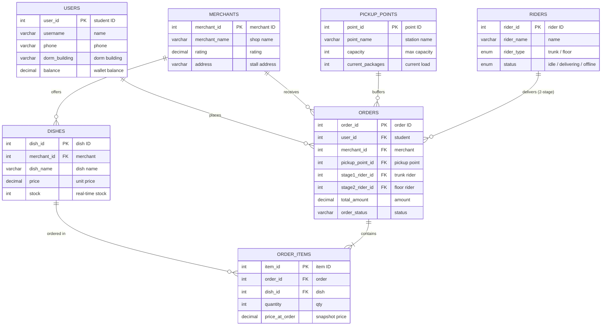

<p align="center">
  
  
  
  
  
  
</p>

<h1 align="center">Campus Delivery Two-Stage Distribution System</h1>

<p align="center">
  <strong>校园外卖两段式配送数据库系统</strong><br>
  Final Defense Project · Flask + ECharts + MySQL + DeepSeek AI
</p>

<p align="center">
  
  
  
</p>

---

## Overview

Traditional food delivery platforms face the **"last 500 meters"** problem on campus: external riders cannot enter dormitory areas, forcing students to pick up orders downstairs — poor experience, low efficiency. This project designs a complete **two-stage distribution database system**, splitting delivery into trunk transport (merchant → pickup point) and floor delivery (pickup point → dorm room), ensuring data consistency and inventory safety under high concurrency via MySQL row-level locks, triggers, and stored procedures.

The system also integrates a Flask + ECharts real-time monitoring dashboard and a DeepSeek Text-to-SQL intelligent query assistant, covering the full pipeline from database design and mock data generation to visual operations.

---

## Core Features

**Two-Stage Delivery Model** — Trunk riders handle bulk transport from merchants to pickup lockers; floor riders handle last-mile delivery from lockers to dorm rooms. Pickup points act as buffer layers decoupling the two stages, enabling trunk riders to carry multiple orders per trip and floor riders to leverage dorm layout familiarity.

**High-Concurrency Anti-Oversell** — `SELECT ... FOR UPDATE` row-level locks protect inventory rows within transactions, combined with pre-order stock validation triggers and post-order auto-deduction triggers. Stored procedures wrap complete transaction rollback, ensuring absolute inventory safety under concurrent scenarios.

**Full Lifecycle State Machine** — 6 order states covering the complete chain: `Paid` → `Stage1_Assigned` (trunk delivery) → `Arrived_At_Point` (awaiting pickup) → `Stage2_Assigned` (floor delivery) → `Completed`, with `Cancelled` triggerable from any prior stage.

**Rider Type Enforcement** — Database-level triggers validate that `Stage1_Trunk` riders can only be assigned to stage 1, and `Stage2_Floor` riders only to stage 2. Attempting to assign a floor rider to trunk delivery (or vice versa) is blocked with a clear error before the write reaches the table.

**Automatic Rider Status** — Rider status (`Idle` / `Delivering`) is fully managed by database triggers: setting `stage1_rider_id` or `stage2_rider_id` automatically flips the rider to `Delivering`; when their segment completes (`Arrived_At_Point` → releases trunk rider, `Completed` → releases floor rider, `Cancelled` → releases both), the rider automatically returns to `Idle`. The active riders KPI on the dashboard reads `SELECT COUNT(*) FROM riders WHERE status = 'Delivering'` — always accurate.

**Real-Time + Historical Dual-Mode Dashboard** — Select "Today" for real-time mode with 30s auto-refresh showing live delivery states; select historical ranges for trend statistics (all orders shown as Completed for delivery timeliness). 5 KPI indicator cards, pickup point saturation monitoring, overflow alerts, merchant ranking, hourly peak analysis, all linked to time range selection.

---

## Entity-Relationship Diagram



<p align="center">
  
  <br>
  <em>Campus Delivery Two-Stage Distribution E-R Diagram</em>
</p>

---

## Database Design

| Table | Records | Description | Key Design |
|-------|---------|-------------|------------|
| `users` | 100 | Students | `balance` wallet, `dorm_building` links to pickup point |
| `merchants` | 20 | Campus merchants | `rating` constraint 1.0~5.0 |
| `dishes` | 160 | Menu items | `stock` real-time inventory, trigger auto-deduction |
| `pickup_points` | 12 | Pickup lockers | `capacity` limit, CHECK constraint prevents overflow |
| `riders` | 15 | Two-stage riders | `rider_type` ENUM (Stage1_Trunk / Stage2_Floor) |
| `orders` | 5,000 | Order master | `order_status` 6-state flow, dual rider tracking |
| `order_items` | ~10,000 | Order details | `price_at_order` snapshot at order time |

**Database objects**: 2 views (`vw_pickup_point_analytics`, `vw_merchant_sales_rank`), 4 stored procedures (create order / arrive at point / floor delivery / cancel), 6 triggers (stock validation, stock deduction, rider type check ×2, rider status auto-manage ×2).

---

## Dashboard Features

| Module | Description |
|--------|-------------|
| KPI Cards | Today's orders, revenue, active riders, active merchants, overflow alerts (red breathing glow) |
| Order Status | Real-time distribution status donut chart with total count |
| Recent Orders | Latest 15 orders with colored status tags |
| Pickup Saturation | 12-point horizontal bar chart, green/yellow/red 3-level alert + overflow line |
| Merchant Ranking | Top 10 merchant sales bar chart, blue gradient |
| Hourly Distribution | Orders bar chart + avg order value line overlay |
| Data Tables | 6 tabs: merchants / students / dishes / riders / pickup points |
| AI Query | Chinese NL question → DeepSeek Text-to-SQL → result table |

---

## Project Structure

| File | Description |
|------|-------------|
| `app.py` | Flask main program, all REST APIs |
| `templates/index.html` | Dashboard frontend (ECharts + vanilla JS) |
| `db.py` | MySQL connection pool (PyMySQL + DBUtils) |
| `campus_delivery_db.sql` | Complete database build script (DDL + triggers + SPs + views) |
| `reinit_db.py` | Python-based database rebuild script |
| `generate_mock_data.py` | Mock data generator (5,000 orders with overflow scenarios) |
| `check_data.py` | Quick data integrity check script |
| `test_app.py` | Automated tests (10 test cases) |
| `requirements.txt` | Python dependency list |
| `.env.example` | Environment variable template |
| `images/er_diagram.png` | E-R entity relationship diagram |

---

## Quick Start

**Requirements**: Python 3.8+ · MySQL 8.0+ · DeepSeek API Key (optional)

```bash
# 1. Clone
git clone https://github.com/sou1maker/database.git
cd campus_delivery_project

# 2. Virtual environment
python -m venv venv
venv\Scripts\activate          # Windows
# source venv/bin/activate     # macOS / Linux

# 3. Install dependencies
pip install -r requirements.txt

# 4. Edit .env with DB credentials and DeepSeek API Key

# 5. Initialize database and generate mock data
python reinit_db.py
python generate_mock_data.py

# 6. Start dashboard at http://localhost:5000
python app.py
```

---

## Tech Stack

| Layer | Technology |
|-------|------------|
| Backend | Python 3.8+ · Flask 3.0+ |
| Frontend | ECharts 5.5 (CDN) · Vanilla HTML/CSS |
| Database | MySQL 8.0+ · Row-level locks · Triggers · Stored Procedures |
| Connection Pool | PyMySQL + DBUtils |
| AI | DeepSeek Chat API (Text-to-SQL) |
| Data | Pandas · Faker |

<p align="center">
  Campus Delivery Two-Stage Distribution System · Final Defense Project<br>
  Flask + ECharts + MySQL + DeepSeek AI · v4.0
</p>
