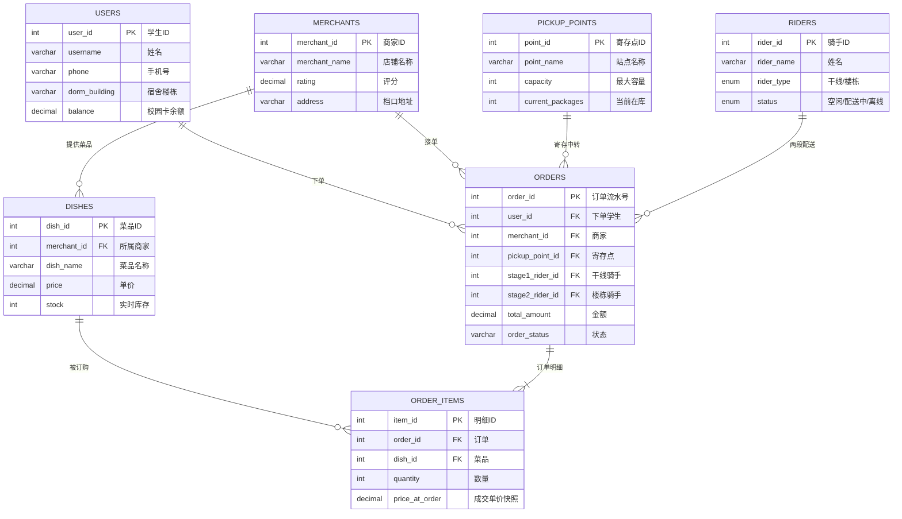

<p align="center">
  
  
  
  
  
  
</p>

<h1 align="center">校园外卖两段式配送数据库系统</h1>

<p align="center">
  <strong>Campus Delivery Two-Stage Distribution Database System</strong><br>
  期末答辩项目 · Flask + ECharts + MySQL + DeepSeek AI 实时监控大屏
</p>

<p align="center">
  
  
  
</p>

---

## 项目简介

传统外卖平台在校园场景下存在**"最后500米"**配送难题：校外骑手无法进入宿舍区，学生需下楼自取，体验差、效率低。本项目设计了一套完整的**两段式配送数据库系统**，将配送链路拆分为干线运输（商家→寄存点）和楼栋配送（寄存点→宿舍）两个独立阶段，通过 MySQL 行级锁、触发器与存储过程保障高并发下的数据一致性与库存安全。

系统同时集成 Flask + ECharts 实时监控大屏与 DeepSeek Text-to-SQL 智能查询助手，覆盖从数据库设计、模拟数据生成到可视化运维的全链路。

---

## 核心功能

**两段式配送模型** — 干线骑手负责商家到寄存点的批量运输，楼栋骑手负责寄存点到宿舍的精准送达。寄存点作为缓冲层解耦两段节奏，干线骑手单次可携带多单提升效率，楼栋骑手熟悉宿舍分布缩短末端时间。

**高并发防超卖机制** — `SELECT ... FOR UPDATE` 行级锁在事务内锁定库存行，配合下单前库存校验触发器与下单后自动扣减触发器，存储过程包裹完整事务回滚，确保并发场景下库存绝对安全。

**全生命周期状态机** — 6 种订单状态覆盖从下单到完成的完整链路：`Paid` → `Stage1_Assigned`（干线配送）→ `Arrived_At_Point`（寄存待取）→ `Stage2_Assigned`（楼栋配送）→ `Completed`（已完成），任意前序阶段均可触发 `Cancelled`。

**实时 + 历史双模式大屏** — 选择"今天"进入实时模式，30 秒自动刷新，展示配送中的真实状态；选择历史时间范围则所有订单显示已完成（外卖时效性），用于趋势统计。5 个 KPI 指标卡、寄存点饱和度监控、爆仓预警、商户排行、时段高峰分析等功能联动时间范围切换。

---

## 实体关系图（E-R 图）



<p align="center">
  
  <br>
  <em>校园外卖两段式配送系统 E-R 实体关系图</em>
</p>

---

## 数据库设计

| 表名 | 记录数 | 说明 | 关键设计 |
|------|--------|------|----------|
| `users` | 100 | 学生用户 | `balance` 校园卡余额，`dorm_building` 关联寄存点 |
| `merchants` | 20 | 校内商家 | `rating` 评分约束 1.0~5.0 |
| `dishes` | 160 | 菜品 | `stock` 实时库存，触发器自动扣减 |
| `pickup_points` | 12 | 寄存中转点 | `capacity` 容量上限，CHECK 约束防超容 |
| `riders` | 15 | 两段骑手 | `rider_type` ENUM 区分干线/楼栋 |
| `orders` | 5,000 | 订单主表 | `order_status` 六状态流转，双骑手 ID 追踪 |
| `order_items` | ~10,000 | 订单明细 | `price_at_order` 下单瞬间价格快照 |

数据库对象：2 个视图（`vw_pickup_point_analytics` 寄存点饱和度、`vw_merchant_sales_rank` 商户排行）、4 个存储过程（下单/到站/楼栋配送/取消）、2 个触发器（库存校验 + 库存扣减）。

---

## 监控大屏功能

| 模块 | 说明 |
|------|------|
| KPI 指标卡 | 今日订单量、营业额、在途骑手、活跃商家、爆仓预警（超标红色呼吸灯） |
| 订单状态分布 | 今日实时配送状态环形图，中心显示订单总数 |
| 近期订单流水 | 最新 15 条订单，彩色状态标签 |
| 寄存点饱和度 | 12 个寄存点横向柱状图，绿/黄/红三级预警 + 爆仓线 |
| 商户销售排行 | Top 10 商户销售额柱状图，蓝色渐变 |
| 时段订单分布 | 各时段订单柱状图 + 客单价折线叠加 |
| 数据明细 | 6 个 Tab 切换查看商户/学生/菜品/骑手/寄存点 |
| AI 智能查询 | 中文问题 → DeepSeek Text-to-SQL → 结果表格 |

---

## 项目结构

| 文件 | 说明 |
|------|------|
| `app.py` | Flask 主程序，含全部 REST API 与内嵌 HTML 监控大屏 |
| `dashboard_app.py` | 启动器（等价于 `python app.py`） |
| `db.py` | MySQL 连接池模块（PyMySQL + DBUtils） |
| `campus_delivery_db.sql` | 完整建库脚本（DDL + 存储过程 + 触发器 + 视图） |
| `reinit_db.py` | Python 版数据库重建脚本 |
| `generate_mock_data.py` | 模拟数据生成器（5000 条订单，含爆仓场景） |
| `requirements.txt` | Python 依赖清单 |
| `images/er_diagram.png` | E-R 实体关系图 |

---

## 快速开始

**环境要求**：Python 3.8+ · MySQL 8.0+ · DeepSeek API Key（可选）

```bash
# 1. 克隆项目
git clone https://github.com/sou1maker/database.git
cd campus_delivery_project

# 2. 创建虚拟环境
python -m venv venv
venv\Scripts\activate          # Windows
# source venv/bin/activate     # macOS / Linux

# 3. 安装依赖
pip install -r requirements.txt

# 4. 编辑 .env 配置数据库密码与 DeepSeek API Key

# 5. 初始化数据库并生成模拟数据
mysql -u root -p < campus_delivery_db.sql
python generate_mock_data.py

# 6. 启动大屏，访问 http://localhost:5000
python app.py
```

---

## 技术栈

| 层级 | 技术 |
|------|------|
| 后端 | Python 3.8+ · Flask 3.0+ |
| 前端 | ECharts 5.5（CDN）· 原生 HTML/CSS |
| 数据库 | MySQL 8.0+ · 行级锁 · 触发器 · 存储过程 |
| 连接池 | PyMySQL + DBUtils |
| AI | DeepSeek Chat API（Text-to-SQL） |
| 数据 | Pandas · Faker |

<p align="center">
  校园外卖两段式配送数据库系统 · 期末答辩项目<br>
  Flask + ECharts + MySQL + DeepSeek AI · v4.0
</p>
