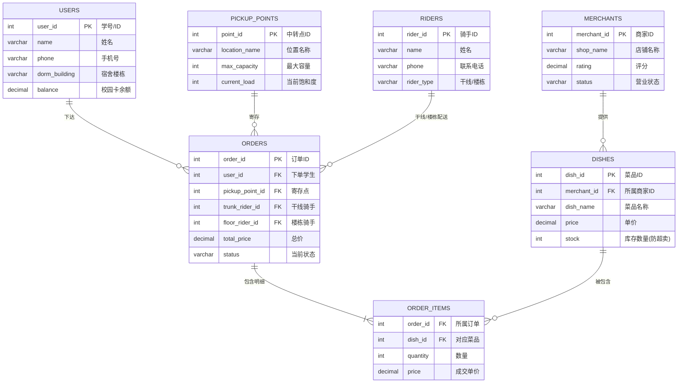
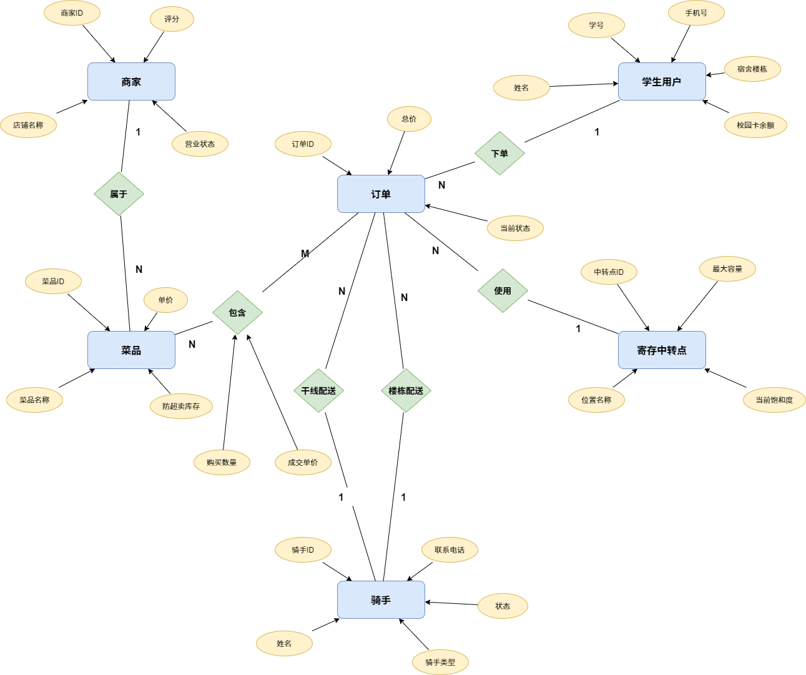
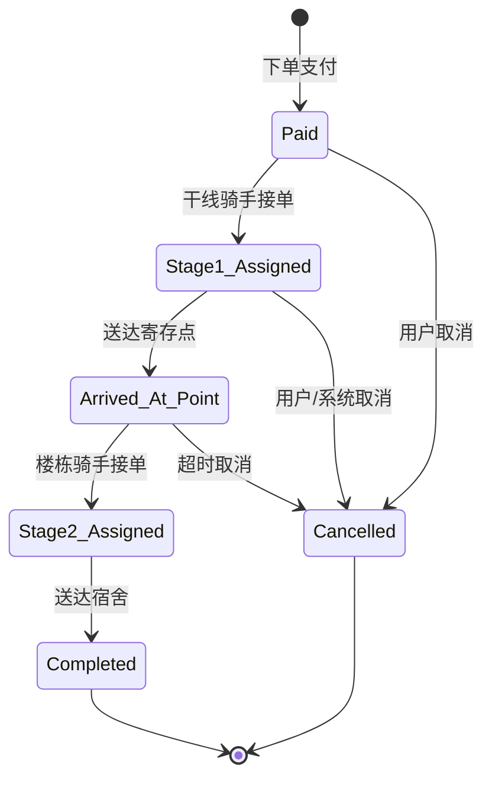

<p align="center">
  
  
  
  
  
  
  
</p>

<h1 align="center">校园外卖两段式配送数据库系统</h1>

<p align="center">
  <strong>Campus Delivery Two-Stage Distribution Database System</strong><br>
  期末答辩项目 · MySQL + Streamlit + DeepSeek AI 全栈数据可视化大屏
</p>

<p align="center">
  
  
  
</p>

---

## 项目概述

本项目设计并实现了一个**校园外卖两段式配送数据库系统**，融合了数据库工程、实时数据可视化和 AI 自然语言查询能力：

| 核心功能 | 说明 |
|---------|------|
| **两段式配送模型** | 干线骑手（商家到寄存点）+ 楼栋骑手（寄存点到宿舍），解决校园外卖"最后 500 米"难题 |
| **高并发防超卖机制** | MySQL 行级锁（`SELECT ... FOR UPDATE`）+ 触发器双重保障，高并发下单安全扣库存 |
| **全生命周期状态机** | 6 种精细化的订单状态流转，双骑手复合追踪，全流程可视化 |
| **实时数据大屏** | 基于 Streamlit 的宽屏可视化大屏，覆盖所有运营维度 |
| **AI 智能数据查询** | 集成 DeepSeek Text-to-SQL：输入中文问题，自动生成 SQL 并返回结果表格 |

---

## 项目结构

```
campus_delivery_project/
├── campus_delivery_db.sql      # 完整数据库建库脚本（DDL + 存储过程 + 触发器 + 视图 + 种子数据）
├── dashboard_app.py            # Streamlit 数据可视化大屏（含 AI 助手）
├── generate_mock_data.py       # 模拟数据生成器（Faker, 100学生/20商家/5000订单）
├── check_data.py               # 数据检查脚本（快速验证各表数据量）
├── reinit_db.py                # Python 版数据库重建脚本
├── requirements.txt            # Python 依赖列表
├── .env.example                # 环境变量配置模板
├── .gitignore                  # Git 忽略规则（.env 已加入忽略，永不提交）
├── .gitattributes              # Git 属性配置（跨平台 LF 换行符）
└── README.md                   # 项目说明文档（当前文件）

```

---

## 快速开始

### 环境要求

- Python 3.8+（推荐 Python 3.12）
- MySQL 8.0+（支持窗口函数和 SIGNAL 语法）
- Git（可选，用于版本控制）
- DeepSeek API Key（可选，用于 AI 助手，[免费申请](https://platform.deepseek.com/)）

### 第一步：克隆 / 下载

```bash
git clone https://github.com/sou1maker/database.git
cd campus_delivery_project
```

### 第二步：创建并激活虚拟环境（推荐）

**Windows：**
```bash
python -m venv venv
venv\Scripts\activate
```

**macOS / Linux：**
```bash
python3 -m venv venv
source venv/bin/activate
```

> **💡 为什么要用虚拟环境？**
> - 隔离项目依赖，避免与全局 Python 环境冲突
> - 保证依赖版本一致，团队协作不出现"在我电脑上能跑"
> - `venv/` 已加入 `.gitignore`，不会提交到 Git 仓库

### 第三步：配置数据库

在 MySQL 中执行建库脚本：

```bash
mysql -u root -p < campus_delivery_db.sql
```

该脚本会自动完成：
- 创建数据库 `campus_delivery_db`
- 创建所有表、索引、视图、触发器、存储过程
- 插入预设的种子数据

### 第四步：配置环境变量

```bash
cp .env.example .env
```

编辑 `.env` 文件，填入你的配置：

```ini
# MySQL 数据库配置
MYSQL_HOST=localhost
MYSQL_USER=root
MYSQL_PASSWORD=your_database_password
MYSQL_DATABASE=campus_delivery_db
MYSQL_CHARSET=utf8mb4

# DeepSeek AI 配置（可选）
DEEPSEEK_API_KEY=your_deepseek_api_key
DEEPSEEK_BASE_URL=https://api.deepseek.com
DEEPSEEK_MODEL=deepseek-chat
```

> **🔒 安全提示**：`.env` 文件已加入 `.gitignore`，禁止提交到 Git 仓库。

### 第五步：安装 Python 依赖

```bash
# 确保已激活虚拟环境（命令行前缀显示 (venv)）
pip install -r requirements.txt
```

> 所有依赖已安装至 `venv/` 目录下，不会影响系统全局 Python。

### 第六步：重建数据库（可选）

如果不想使用 `campus_delivery_db.sql`，可以用 Python 脚本重建：

```bash
# 确保已激活虚拟环境
python reinit_db.py
```

### 第七步：生成模拟数据（可选）

```bash
python generate_mock_data.py
```

将会生成：
- **100** 名学生用户
- **20** 家商家（每家 8 道菜品）
- **5000** 条历史订单记录
- 寄存点爆仓预警数据

### 第八步：启动大屏

```bash
streamlit run dashboard_app.py
```

浏览器会自动打开，访问 **http://localhost:8501** 即可查看实时数据监控大屏。

---

## 数据库核心设计

### 实体关系图（E-R 图）



<p align="center">
  
  <br>
  <em>图：校园外卖两段式配送系统 E-R 实体关系图</em>
</p>

### 两段式状态机



| 状态 | 含义 | 说明 |
|------|------|------|
| `Paid` | 已支付 | 学生下单并完成支付 |
| `Stage1_Assigned` | 干线配送中 | 干线骑手从商家取餐，配送至寄存点 |
| `Arrived_At_Point` | 已到寄存点 | 餐品到达中转寄存点，等待楼栋骑手 |
| `Stage2_Assigned` | 楼栋配送中 | 楼栋骑手从寄存点取餐，配送至宿舍 |
| `Completed` | 已完成 | 学生成功收到餐品 |
| `Cancelled` | 已取消 | 订单在任何阶段被取消 |

### 核心表结构

| 表名 | 说明 | 关键字段 |
|------|------|----------|
| `users` | 学生用户 | `balance`（校园卡余额），`dorm_building`（宿舍楼栋） |
| `merchants` | 商家信息 | `rating`（评分），`address`（地址） |
| `dishes` | 菜品 | `stock`（实时库存），`status`（上架状态） |
| `pickup_points` | 寄存中转点 | `capacity`（最大容量），`current_packages`（当前在库） |
| `riders` | 两段式骑手 | `rider_type`（干线/楼栋），`status`（工作状态） |
| `orders` | 订单主表（核心） | `order_status`（状态机），双骑手 ID 追踪 |
| `order_items` | 订单明细 | `quantity`（数量），`price_at_order`（单价快照） |

### 高并发安全保障

- **防超卖触发器**：`trg_check_dish_stock_before_order` 插入订单明细前使用 `SELECT ... FOR UPDATE` 行级锁检查库存
- **自动扣库存触发器**：`trg_reduce_dish_stock_after_order` 下单成功后自动扣除库存
- **事务保护**：所有存储过程包含完整的事务回滚机制

---

## 大屏功能

| 模块 | 功能 | 技术实现 |
|------|------|----------|
| **时间范围筛选** | 侧边栏选择"今天/最近7天/最近30天/本月/全部"，所有图表联动刷新 | Streamlit session_state + 动态 SQL 拼接 |
| **时段订单分布（高峰分析）** | 按早餐/午餐高峰/晚餐高峰/夜宵展示订单量，统计高峰占比 | Matplotlib 柱状图 + CASE WHEN 分组 |
| **寄存点饱和度监控** | 容量柱状图 + 爆仓阈值线 + 预警卡片 | Matplotlib 条件着色 |
| **商户销售排行** | 横向柱状图 Top 10 + 数据表格 | Seaborn 渐变色板 + Pandas |
| **订单状态分布** | 环形饼图 + 健康进度条 | Matplotlib 环形图 + 自定义 CSS |
| **近期订单流水** | 最新 10 条订单详情，状态彩色标签 | 自定义 HTML 表格渲染 |
| **AI 智能数据助手** | 输入中文问题，AI 生成 SQL 并返回结果 | DeepSeek Text-to-SQL 推理引擎 |

### AI 智能数据助手 -- 核心功能

> **用自然语言查询数据，无需 SQL 知识。**

- **自然语言转 SQL**：集成 DeepSeek Chat 模型，自动将中文问题转换为 MySQL 查询语句
- **感知数据库结构**：AI 预加载完整的数据库 Schema 信息，理解字段语义和关系
- **安全拦截**：只允许 SELECT 查询，INSERT/UPDATE/DELETE 等操作自动拦截
- **对话交互**：支持多轮对话历史，一键示例问题
- **自动图表**：查询结果含数值列时，自动生成柱状图和折线图
- **CSV 下载**：查询结果支持一键下载为 CSV 文件

**示例问题：**
- "哪个商家销售额最高？"
- "共有多少学生注册？"
- "各寄存点饱和度如何？"
- "哪个宿舍楼栋订单最多？"

---

## 技术栈

| 技术 | 用途 |
|------|------|
| **Python 3.8+** | 后端逻辑与数据处理 |
| **Streamlit** | 实时数据可视化大屏框架 |
| **MySQL 8.0+** | 关系型数据库（窗口函数、触发器、存储过程） |
| **DeepSeek Chat** | AI Text-to-SQL 推理引擎 |
| **Pandas** | 数据清洗与分析 |
| **Matplotlib + Seaborn** | 图表可视化 |
| **PyMySQL** | Python MySQL 数据库驱动 |
| **Faker** | 模拟数据生成 |
| **python-dotenv** | 环境变量安全管理 |

---

## 贡献指南

1. Fork 本仓库
2. 创建特性分支：`git checkout -b feature/新功能`
3. 提交更改：`git commit -m '添加新功能'`
4. 推送分支：`git push origin feature/新功能`
5. 提交 Pull Request

---

## 许可证

本项目仅供学习使用。

---

<p align="center">
  
</p>

<p align="center">
  校园外卖两段式配送数据库系统 · 期末答辩项目<br>
  基于 Streamlit & MySQL & DeepSeek AI
</p>
